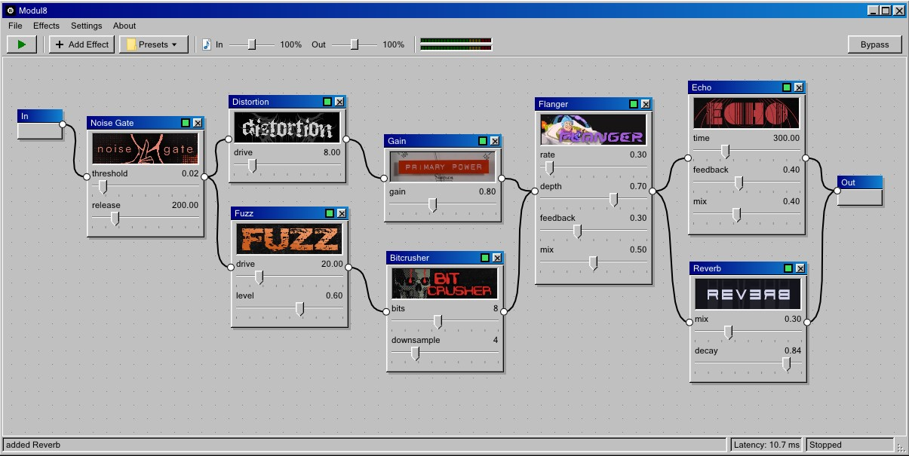

  

# modul8

A small real-time guitar effects host for Windows. Plug your guitar into an
audio interface, drop pedals on a board, wire them together and play.

Effects are Lua scripts running on LuaJIT, so you can write your own pedals
in a few lines and hot reload them without restarting the app.

## download

Grab the latest build from the [releases](https://github.com/santikzz/modul8/releases)
page, unzip it anywhere and run `modul8.exe`.

## using it

1. Run `modul8.exe`.
2. Open `Settings > Manage settings` and pick your input device, output device and buffer size.
3. Press the play button in the toolbar to start the audio stream.
4. Click `Add Effect` to drop pedals on the board, then drag cables between ports to build your signal chain.
5. Save your board from the `Presets` menu.

Lower buffer sizes mean lower latency. If you hear crackles, raise it.

## custom effects

Every pedal is a single `.lua` file in the `effects/` folder. Drop a new file
in and hit `Effects > Reload Lua Effects` to pick it up, no restart needed.

The full scripting contract lives in [effects.md](effects.md): the globals the
host reads, the process callback, knob definitions, realtime rules and a
complete example. It is self-contained, so the easiest way to make a pedal is
to paste `effects.md` into an LLM and describe the effect you want. The
document has everything needed to produce a correct, realtime-safe script.

## building

Open `modul8.sln` in Visual Studio 2022 and build Release x64. The build
copies `lua51.dll` (LuaJIT) next to the exe.

## license

[PolyForm Noncommercial 1.0.0](LICENSE). Free to use, copy, modify and share
for any noncommercial purpose. Commercial use is not permitted.
